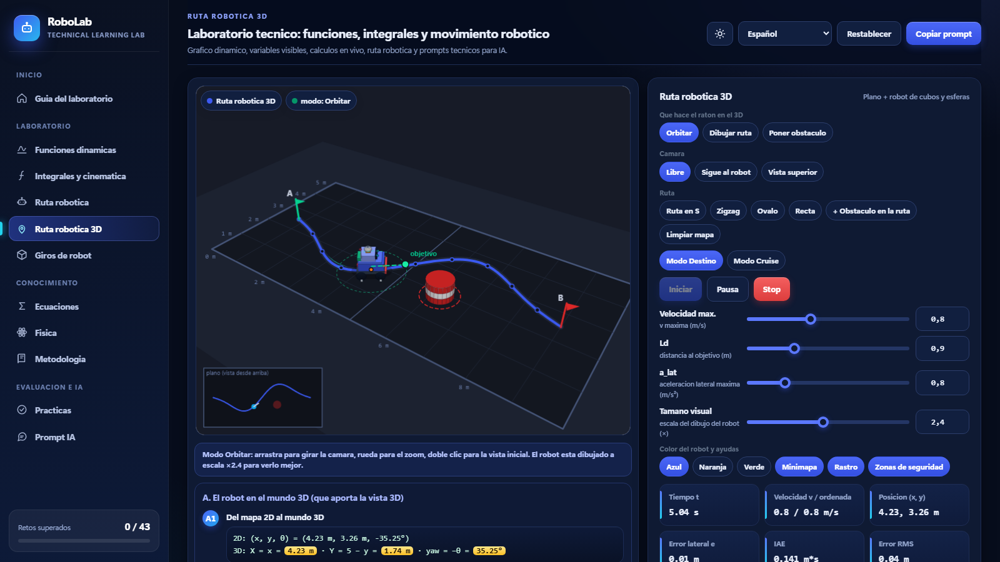
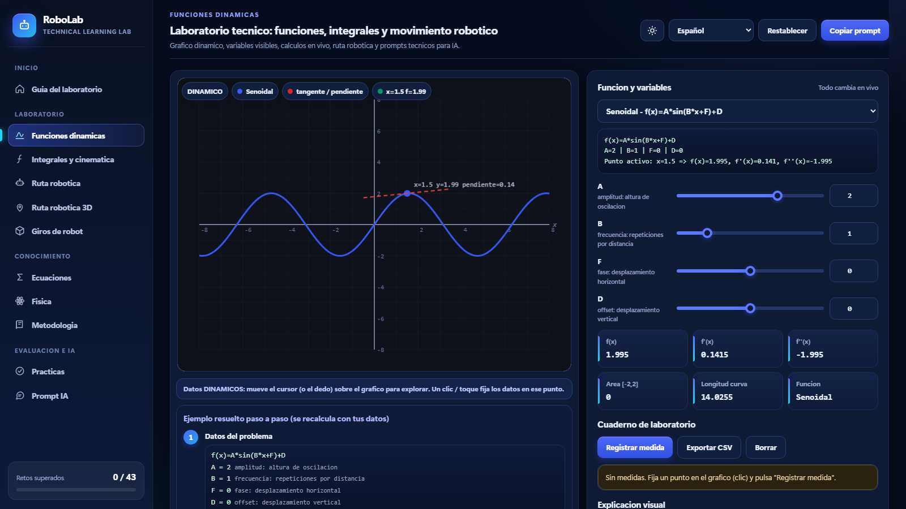
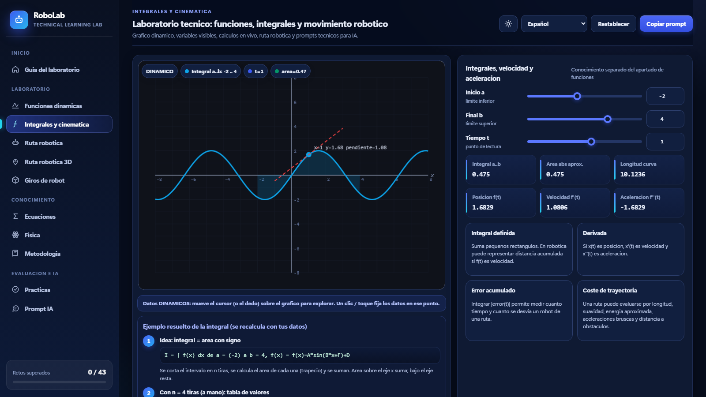
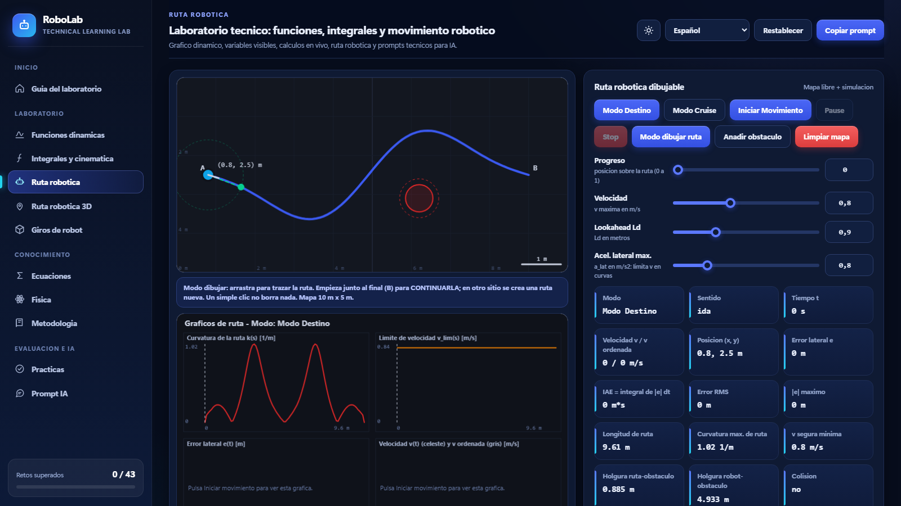
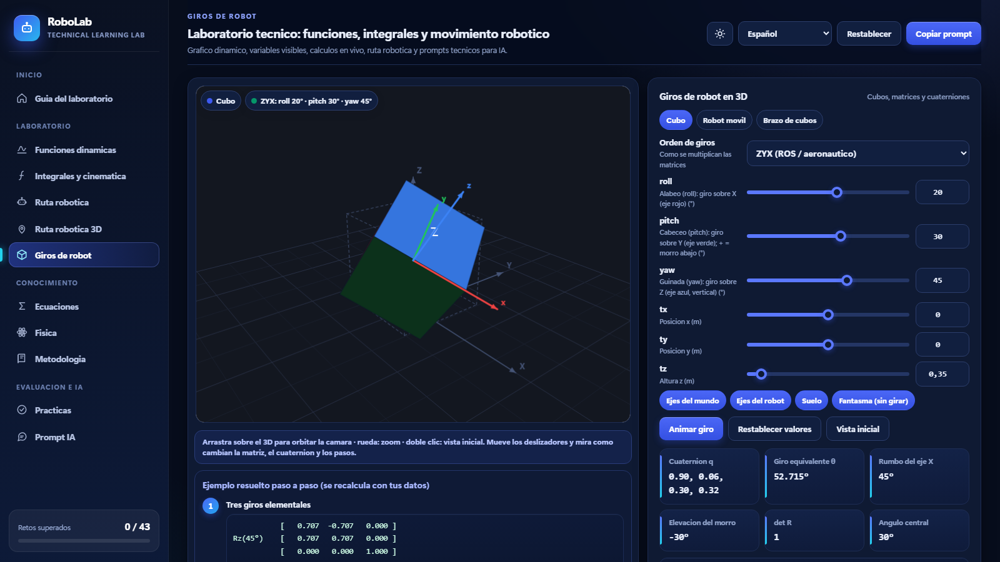
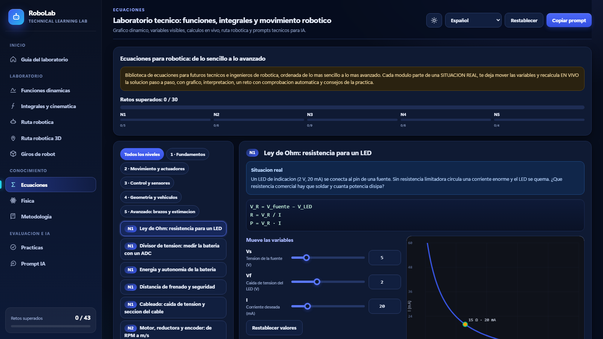
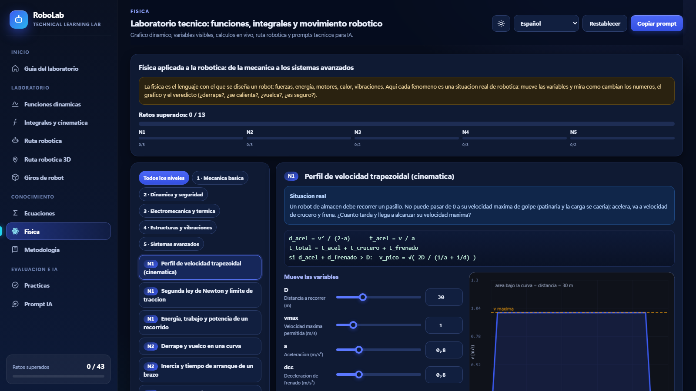
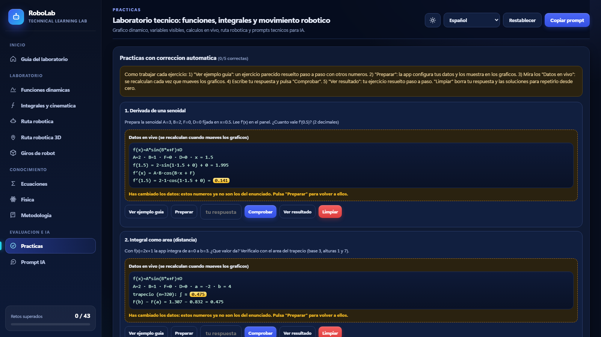
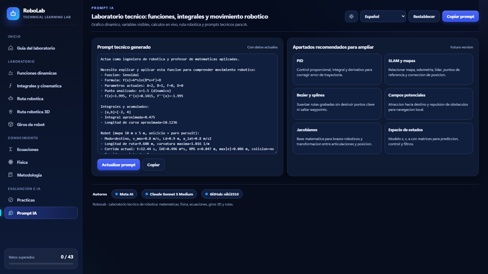

# RoboLab – Laboratorio técnico de robótica

**RoboLab** es un laboratorio interactivo para aprender funciones, cálculo, física y movimiento robótico. Todo vive en **un solo archivo HTML**: sin instalación, sin servidor y sin conexión a internet. Cambias una variable y ves al instante el gráfico, las fórmulas y los resultados.

## Qué puedes hacer

- **Ver el cálculo en vivo**: cada deslizador recalcula el gráfico, la matriz y los pasos del ejemplo resuelto.
- **Simular un robot móvil** que sigue una ruta esquivando obstáculos, con métricas de error (IAE, RMS, holgura).
- **Entender los giros 3D** con matrices, ángulos de Euler y cuaterniones.
- **Practicar con retos** (43 en total) y **copiar prompts técnicos** listos para usar con una IA.
- Cambiar entre **tema claro y oscuro** y entre idiomas.

## Módulos

### Funciones dinámicas
Elige una función (senoidal, etc.), mueve sus parámetros y explora con el cursor: valor, derivada, área y longitud de curva. Incluye cuaderno de laboratorio con exportación a CSV.

### Integrales y cinemática
Del área bajo la curva a la posición y velocidad de un móvil.

### Ruta robótica
Seguimiento de ruta en 2D con control y obstáculos.

### Ruta robótica 3D
El mismo robot en un mundo 3D: cámara libre o que sigue al robot, ruta dibujada con el ratón, obstáculos, modo Destino y modo Cruise, y minimapa.

### Giros de robot
Cubo, robot móvil y brazo de cubos. Cambia roll, pitch y yaw, elige el orden de giros (ZYX, etc.) y mira cómo cambian la matriz R, el cuaternión y el ángulo equivalente. Detecta el bloqueo de cardán.

### Ecuaciones

### Física

### Prácticas y Prompt IA
Retos con progreso guardado y prompts técnicos para pedir ayuda a una IA con el contexto ya preparado.

## Cómo usarlo

1. Descarga [DOC-20260919-WA0010.htm](DOC-20260919-WA0010.htm) (botón *Raw* → guardar como).
2. Ábrelo con cualquier navegador moderno (Chrome, Edge, Firefox, Safari).

## Estructura del repositorio

| Ruta | Descripción |
|---|---|
| `DOC-20260919-WA0010.htm` | Versión actual del laboratorio |
| `DOC-20260919-WA0010.backup.htm` | Copia de seguridad anterior |
| `old/` | Versiones previas |
| `docs/img/` | Capturas usadas en este README |

## Autores

Meta AI, Claude Sonnet 5 Medium y [niki2510](https://github.com/niki2510) en GitHub.
